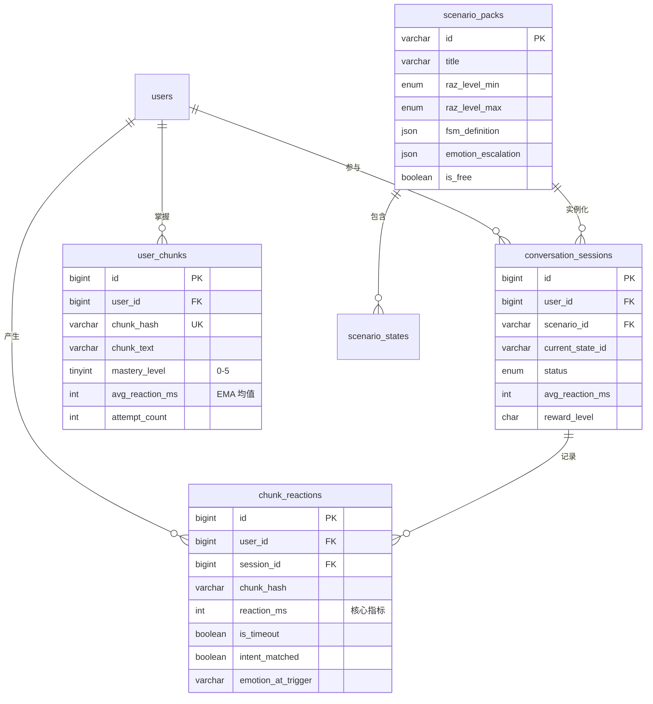

# NeuroGlot 实时对话引擎架构 (Real-Time Conversation Engine)

> "400ms 不是产品指标，是神经元内化的物理证据。超过这个阈值，大脑就已经启动了翻译器。"

本文档定义 NeuroGlot 实时口语重塑引擎的核心技术架构。系统采用 **RN(UI) + Rust(JSI 性能核心) + GLM-4-Voice(端到端语音) + 轻量 FSM 后端** 的四层混合架构，围绕"用情绪对抗焦虑、用 Rust 对抗延迟"的核心理念展开。

---

## 任务 1：系统时序图 (Multi-Agent Sequence Diagram)

以下时序图展示了一次包含"用户卡壳超时 → 环境压迫 → 极速条件反射成功"的完整对话回合。

```mermaid
sequenceDiagram
    autonumber
    actor User as 目标用户 (戴着 Persona 面具)
    participant RN as React Native<br/>(UI + 状态管理)
    participant Rust as Rust Core<br/>(JSI 性能核心)
    participant VAD as VAD Engine<br/>(Rust 内置模块)
    participant WS as WebSocket Manager<br/>(Rust 内置模块)
    participant GLM as GLM-4-Voice<br/>(智谱端到端语音)
    participant FSM as 场控 FSM<br/>(状态机中枢)
    participant ENV as 环境渲染 Agent<br/>(UI 压迫指令)

    Note over FSM: 场景: 海关入境<br/>当前状态: S2 (等待用户说出旅行目的)<br/>目标 Chunk: "business trip"

    %% ═══ Phase 1: NPC 发话 ═══
    rect rgb(30, 35, 50)
    Note right of GLM: NPC 发话阶段
    FSM->>RN: 推送当前状态 {state: S2, expected_chunks: ["business trip", "5 days"]}
    GLM-->>WS: 流式回传 NPC 音频帧 (带不耐烦情绪)
    WS-->>Rust: PCM 音频帧解码
    Rust-->>RN: onNPCAudio(pcmFrames) → 扬声器播放
    RN->>RN: 渲染字幕 + 场景 UI (海关柜台)
    Rust->>Rust: 检测 NPC 音频流结束
    Rust->>RN: onNPCAudioEnd() — JSI 同步回调
    end

    %% ═══ Phase 2: 计时启动 + VAD 监听 ═══
    rect rgb(35, 35, 30)
    Note right of Rust: 🎯 计时器启动（Instant::now()）
    RN->>Rust: startListening() — JSI 零拷贝调用
    Rust->>VAD: 激活麦克风 PCM 采集 + 能量检测
    Rust->>Rust: timer_start = Instant::now()
    end

    %% ═══ Phase 3: 用户卡壳超时 ═══
    rect rgb(50, 25, 25)
    Note over User, VAD: ⏱️ 用户陷入词汇搜索...<br/>沉默持续 > 2000ms
    VAD-->>Rust: 连续 2000ms 未检测到有效语音能量
    Rust->>Rust: elapsed = 2000ms > TIMEOUT_THRESHOLD
    Rust->>RN: onTimeout(elapsed_ms: 2000) — JSI 回调

    Note right of RN: 🔴 超时惩罚链触发
    RN->>FSM: reportTimeout(session_id, state: S2, elapsed: 2000)
    FSM->>FSM: timeout_count += 1; 不挂起状态机
    FSM->>ENV: dispatchPressure(intensity: HIGH)
    ENV-->>RN: 视觉指令 {edge_pulse: RED, freq: 2Hz, ambient: "crowd_impatient"}
    RN->>RN: 渲染边缘红色脉冲 + 注入嘈杂人群催促环境音

    FSM->>GLM: 组装催促 Prompt (含词汇防火墙约束)
    Note right of GLM: Prompt: [Impatient] 海关官员<br/>"I don't have all day.<br/>Why are you here?"<br/>(词汇墙: Level ≤ 用户 RAZ)
    GLM-->>WS: 流式回传催促音频 (带叹气和不耐烦语气)
    WS-->>Rust: 解码 PCM
    Rust-->>RN: onNPCAudio → 播放催促
    Rust->>Rust: 重置 timer_start = Instant::now()
    end

    %% ═══ Phase 4: 用户条件反射成功 ═══
    rect rgb(25, 45, 30)
    Note over User, VAD: ⚡ 压迫感触发肌肉记忆
    User->>VAD: 脱口而出 "Business trip, 5 days"
    VAD-->>Rust: 检测到语音起始点 (voice_onset)
    Rust->>Rust: reaction_ms = Instant::now() - timer_start = 350ms ✅
    Rust->>RN: onVoiceDetected(reaction_ms: 350) — JSI 回调

    Note right of Rust: 音频流转发至 GLM-4-Voice
    Rust->>WS: 实时转发用户 PCM 音频帧
    User->>VAD: (用户说完，停顿 > 600ms)
    VAD-->>Rust: 检测到语音结束点 (voice_end)
    Rust->>WS: 发送 end_of_utterance 信号
    WS->>GLM: 完整用户音频段 + 意图识别请求

    GLM-->>WS: 返回意图解析结果
    Note right of GLM: intent_match: true<br/>matched_chunks: ["business trip", "5 days"]<br/>confidence: 0.92
    WS-->>Rust: 解析 GLM 响应
    Rust->>RN: onIntentResult({matched: true, chunks: [...], reaction_ms: 350})

    Note right of RN: 🟢 极速通关激励
    RN->>FSM: reportSuccess(chunks: ["business trip", "5 days"], reaction_ms: 350)
    FSM->>FSM: 状态流转 S2 → S3
    FSM->>ENV: dispatchReward(intensity: HIGH)
    ENV-->>RN: 视觉指令 {glow: GREEN, haptic: SUCCESS, sound: "level_up"}
    RN->>RN: 绿光包裹 + 震动反馈 + 成就音效
    FSM->>FSM: 写入遥测: chunk="business trip", reaction_ms=350, scenario="customs"
    end
```

### 时序图设计关键点

| 维度 | 设计决策 | 理由 |
|------|---------|------|
| **计时精度** | `Instant::now()` 在 Rust 侧完成，不过 JS Bridge | JS 的 `Date.now()` 精度仅 ~5ms，且受 GC 暂停影响；Rust 的 `Instant` 精度达纳秒级 |
| **音频流路径** | 麦克风 → Rust PCM → WebSocket → GLM-4-Voice | 音频帧不经过 JS 线程，避免序列化/反序列化开销和 GC 暂停 |
| **超时不挂起** | 状态机收到 timeout 后不暂停，而是触发环境压迫并重置计时器 | 模拟真实对话：对方不会等你想好，只会越来越不耐烦 |
| **词汇防火墙时机** | 在组装 GLM Prompt 阶段注入词汇约束，而非对输出做后置过滤 | 端到端模型直接输出音频，无法做文本级后置拦截；必须前置约束 |

---

## 任务 2：Rust 核心功能接口设计 (JSI Bindings)

### 2.1 TypeScript 接口定义（RN 侧看到的 JSI API）

```typescript
/**
 * NeuroGlot Rust Core — JSI 接口
 * 
 * 所有回调均在 Rust 线程触发后通过 JSI 同步桥接至 JS 线程。
 * 音频数据不过 Bridge，仅传递事件信号和标量值。
 */

interface NeuroglotRustCore {
  // ─── 生命周期 ───────────────────────────────────
  
  /** 初始化音频管线（麦克风权限、音频会话、VAD 模型加载） */
  initialize(config: AudioConfig): Promise<void>;
  
  /** 释放全部底层资源 */
  destroy(): void;

  // ─── GLM-4-Voice WebSocket ─────────────────────
  
  /** 建立与 GLM-4-Voice 的全双工 WebSocket 连接 */
  connectGLM(url: string, token: string): Promise<void>;
  
  /** 断开 WebSocket */
  disconnectGLM(): void;
  
  /** 
   * 向 GLM-4-Voice 发送系统级 Prompt（角色面具 + 词汇防火墙）
   * 每次场景切换时调用一次
   */
  sendSystemPrompt(prompt: string): void;

  // ─── 音频控制 ───────────────────────────────────
  
  /** 开始录音 + VAD 监控 + 精确计时 */
  startListening(): void;
  
  /** 停止录音 */
  stopListening(): void;
  
  /** 
   * 标记 NPC 音频播放结束，Rust 立刻启动反应计时器
   * 这个调用是整个 400ms 指标的起点
   */
  markNPCAudioEnd(): void;
  
  /** 播放 NPC 音频（从 GLM WebSocket 接收的 PCM 帧） */
  playNPCAudio(pcmBase64: string): void;

  // ─── 事件回调注册 ─────────────────────────────

  /** 用户开口的第一个有效音节被检测到 */
  onVoiceDetected(cb: (event: VoiceDetectedEvent) => void): void;
  
  /** 用户停顿超时（连续静音超过阈值） */
  onTimeout(cb: (event: TimeoutEvent) => void): void;
  
  /** NPC 音频帧到达（用于扬声器播放） */
  onNPCAudio(cb: (event: NPCAudioEvent) => void): void;
  
  /** NPC 音频流结束 */
  onNPCAudioEnd(cb: () => void): void;
  
  /** GLM-4-Voice 返回意图识别结果 */
  onIntentResult(cb: (event: IntentResultEvent) => void): void;
  
  /** 连接状态变化 */
  onConnectionStateChange(cb: (state: ConnectionState) => void): void;
}

// ─── 类型定义 ─────────────────────────────────────

interface AudioConfig {
  sampleRate: 16000;           // GLM-4-Voice 要求 16kHz
  channels: 1;                 // 单声道
  vadThresholdDb: -35;         // 语音能量阈值（dB）
  timeoutMs: 2000;             // 超时阈值（毫秒）
  silenceEndMs: 600;           // 语音结束判定静音时长
}

interface VoiceDetectedEvent {
  reactionMs: number;          // Instant::now() - npc_audio_end 的精确毫秒差
  energyDb: number;            // 首个有效帧的能量值
}

interface TimeoutEvent {
  elapsedMs: number;           // 已经过的毫秒数
  consecutiveTimeouts: number; // 当前状态的连续超时次数
}

interface NPCAudioEvent {
  pcmData: ArrayBuffer;        // 通过 JSI 零拷贝共享的 PCM 数据
  isLast: boolean;             // 是否为最后一帧
}

interface IntentResultEvent {
  matched: boolean;
  matchedChunks: string[];     // 命中的 Chunk 列表
  confidence: number;          // 0.0 - 1.0
  reactionMs: number;          // 用户反应耗时
  transcription: string;       // ASR 粗文本（仅供调试）
}

type ConnectionState = 'connecting' | 'connected' | 'reconnecting' | 'disconnected';
```

### 2.2 Rust 核心逻辑伪代码

```rust
//! neuroglot-core — 性能核心引擎
//!
//! 设计原则：
//! 1. 音频帧永远不过 JS Bridge（零拷贝 JSI SharedArrayBuffer）
//! 2. 计时使用 Instant，精度纳秒级，不受系统时钟调整影响
//! 3. VAD 在独立线程运行，通过 crossbeam channel 与主线程通信

use std::time::Instant;
use std::sync::atomic::{AtomicBool, AtomicU64, Ordering};
use crossbeam_channel::{Sender, Receiver};

// ─── 核心状态 ─────────────────────────────────────

/// VAD 事件类型
enum VadEvent {
    /// 检测到语音起始（从静音到有声）
    VoiceOnset { energy_db: f32 },
    /// 检测到语音结束（持续静音 > silence_end_ms）
    VoiceEnd,
    /// 超时（从 npc_audio_end 起持续静音 > timeout_ms）
    Timeout { elapsed_ms: u64 },
}

/// 引擎核心状态机
struct NeuroglotEngine {
    // 精确计时器状态
    npc_audio_end_instant: Option<Instant>,
    voice_onset_instant: Option<Instant>,
    is_listening: AtomicBool,
    
    // VAD 配置
    vad_threshold_db: f32,
    timeout_ms: u64,
    silence_end_ms: u64,
    consecutive_timeouts: AtomicU64,
    
    // 跨线程通信
    vad_tx: Sender<VadEvent>,
    vad_rx: Receiver<VadEvent>,
    
    // WebSocket 连接
    ws_handle: Option<WebSocketHandle>,
    
    // JSI 回调句柄（通过 neon 或 uniffi 桥接）
    jsi_callbacks: JsiCallbackRegistry,
}

impl NeuroglotEngine {
    /// 标记 NPC 音频结束 — 这是 400ms 指标的起点
    /// 由 JS 线程通过 JSI 同步调用，必须 O(1)
    fn mark_npc_audio_end(&self) {
        self.npc_audio_end_instant = Some(Instant::now());
        self.consecutive_timeouts.store(0, Ordering::Relaxed);
    }

    /// VAD 音频帧处理 — 在独立音频线程中运行
    /// 每 20ms 调用一次（16kHz × 20ms = 320 个采样点）
    fn process_audio_frame(&self, pcm_frame: &[i16]) {
        // 1. 计算帧能量（RMS → dB）
        let rms = (pcm_frame.iter()
            .map(|&s| (s as f64).powi(2))
            .sum::<f64>() / pcm_frame.len() as f64)
            .sqrt();
        let energy_db = 20.0 * (rms / 32768.0).max(1e-10).log10() as f32;
        
        // 2. 判断是否为有效语音
        let is_voice = energy_db > self.vad_threshold_db;
        
        if is_voice {
            if self.voice_onset_instant.is_none() {
                // ═══ 首次检测到语音 ═══
                let now = Instant::now();
                self.voice_onset_instant = Some(now);
                
                // 计算反应时间：从 NPC 音频结束到用户开口
                let reaction_ms = self.npc_audio_end_instant
                    .map(|t| now.duration_since(t).as_millis() as u64)
                    .unwrap_or(0);
                
                self.vad_tx.send(VadEvent::VoiceOnset { energy_db }).ok();
                
                // 通过 JSI 零延迟回调 JS 线程
                self.jsi_callbacks.fire_voice_detected(reaction_ms, energy_db);
            }
            
            // 3. 实时转发音频帧至 GLM-4-Voice WebSocket
            if let Some(ws) = &self.ws_handle {
                ws.send_audio_frame(pcm_frame);
            }
            
            // 重置静音计数器
            self.silence_counter_reset();
            
        } else {
            // 静音帧处理
            self.silence_counter_increment(20); // 每帧 20ms
            
            let silence_ms = self.silence_counter_ms();
            
            // 检查：用户已经在说但停下了（语音结束判定）
            if self.voice_onset_instant.is_some() && silence_ms >= self.silence_end_ms {
                self.vad_tx.send(VadEvent::VoiceEnd).ok();
                self.voice_onset_instant = None;
                
                // 通知 WebSocket 发送 end_of_utterance
                if let Some(ws) = &self.ws_handle {
                    ws.send_end_of_utterance();
                }
            }
            
            // 检查：用户一直没开口（超时判定）
            if self.voice_onset_instant.is_none() {
                if let Some(start) = self.npc_audio_end_instant {
                    let elapsed = Instant::now().duration_since(start).as_millis() as u64;
                    if elapsed >= self.timeout_ms {
                        let count = self.consecutive_timeouts
                            .fetch_add(1, Ordering::Relaxed) + 1;
                        
                        self.vad_tx.send(VadEvent::Timeout { elapsed_ms: elapsed }).ok();
                        
                        // 通过 JSI 回调 JS 线程触发惩罚
                        self.jsi_callbacks.fire_timeout(elapsed, count);
                        
                        // 重置起点（等待环境 Agent 催促后重新计时）
                        self.npc_audio_end_instant = None;
                    }
                }
            }
        }
    }
    
    /// 计算并记录用户对特定 Chunk 的反应延迟
    /// 用于 user_chunks.avg_reaction_ms 的 EMA 更新
    fn compute_reaction_metric(
        &self,
        chunk_hash: &str,
        reaction_ms: u64,
        prev_avg: f64,
        attempt_count: u64,
    ) -> f64 {
        // 指数移动平均（EMA），alpha=0.3 偏向近期表现
        // 避免早期异常值永久拖低均值
        let alpha = if attempt_count < 5 { 0.5 } else { 0.3 };
        prev_avg * (1.0 - alpha) + reaction_ms as f64 * alpha
    }
}
```

### 2.3 JSI 桥接关键约束

| 约束 | 说明 |
|------|------|
| **音频帧不序列化** | PCM 数据通过 `jsi::SharedArrayBuffer` 共享内存，RN 直接读取 Rust 分配的缓冲区。零拷贝。 |
| **回调是同步的** | `onVoiceDetected` 等回调通过 JSI 同步桥接，不走 React Native 的异步 Bridge。延迟 < 1ms。 |
| **VAD 独立线程** | Rust 创建专用音频线程，优先级设为 `SCHED_FIFO` (Linux/Android) 或 `QOS_CLASS_USER_INTERACTIVE` (iOS)。 |
| **Instant 不可替代** | 禁止在任何计时逻辑中使用 `SystemTime` 或 JS 的 `Date.now()`。前者受 NTP 校正影响，后者精度不足且受 GC Pause 干扰。 |

---

## 任务 3：GLM-4-Voice 与状态机集成逻辑

### 3.1 场景状态机 (Scenario FSM) 数据结构

```typescript
/**
 * 场景状态机定义（JSON 可序列化，存储在后端/本地缓存）
 * 
 * 每个场景包（如"海关入境"）是一个完整的有限状态机。
 * 状态流转完全由意图匹配驱动，拒绝语法纠错。
 */

interface ScenarioDefinition {
  id: string;                    // "customs_entry_v2"
  title: string;                 // "海关入境"
  razLevelMin: RazLevel;         // 最低要求 RAZ 等级
  razLevelMax: RazLevel;         // 词汇墙上界
  persona: PersonaConfig;        // 角色面具配置
  states: ScenarioState[];       // 状态节点
  transitions: StateTransition[]; // 状态转移边
  initialState: string;          // 起始状态 ID
  successState: string;          // 通关状态 ID
  failureState: string;          // 失败状态 ID
}

interface PersonaConfig {
  npcName: string;               // "Officer Johnson"
  npcRole: string;               // "海关检查官"
  emotionBaseline: EmotionTag;   // 基础情绪（会随超时升级）
  emotionEscalation: EmotionTag[]; // 情绪升级链
  voiceId: string;               // GLM-4-Voice 音色 ID
  playerPersona: string;         // 用户面具描述
}

type EmotionTag = 
  | 'neutral' | 'professional' | 'warm'
  | 'impatient' | 'suspicious' | 'aggressive' 
  | 'sarcastic' | 'threatening';

interface ScenarioState {
  id: string;                    // "S2_purpose"
  description: string;           // "等待用户说出访问目的"
  npcPrompt: string;             // NPC 在进入此状态时说的话
  expectedChunks: string[];      // 目标 Chunk（任意命中一个即可流转）
  maxTimeouts: number;           // 最大超时次数（超过则强制流转至 failBranch）
  timeoutEscalationIdx: number;  // 当前超时对应的情绪升级索引
  failBranch?: string;           // 超时耗尽后的跳转状态
  hints: string[];               // 提示短语（3 次超时后可选择性展示）
}

interface StateTransition {
  from: string;
  to: string;
  condition: TransitionCondition;
}

interface TransitionCondition {
  type: 'intent_match' | 'timeout_exhaust' | 'manual';
  requiredChunks?: string[];     // 需要命中的 Chunk
  minConfidence?: number;        // 最低置信度（默认 0.7）
}
```

### 3.2 GLM-4-Voice Prompt 组装引擎

```python
# prompt_assembler.py — GLM-4-Voice System Prompt 组装器
#
# 设计哲学：
# 1. 词汇防火墙在 Prompt 层强制注入，而非对输出后置过滤
#    因为 GLM-4-Voice 直接输出音频流，无法做文本级拦截
# 2. 角色面具(Persona)和情绪标签是分离的维度
#    同一个 NPC 的基础人设不变，但情绪随超时次数升级
# 3. 禁止在 Prompt 中出现"纠正用户语法"的任何暗示

def assemble_glm_prompt(
    scenario: ScenarioDefinition,
    current_state: ScenarioState,
    user_raz_level: str,
    vocab_wall: set[str],
    timeout_count: int,
) -> str:
    """
    组装发送给 GLM-4-Voice 的完整 System Prompt。
    
    这个 Prompt 在每次状态流转或超时惩罚时重新组装并发送。
    """
    
    persona = scenario.persona
    
    # 情绪升级：根据超时次数递进
    emotion_idx = min(timeout_count, len(persona.emotion_escalation) - 1)
    current_emotion = persona.emotion_escalation[emotion_idx]
    
    # 词汇墙：取前 200 个最高频词作为 Prompt 示例
    # （完整词汇墙通过 system 级约束注入，此处仅给 LLM 建立边界感知）
    vocab_sample = sorted(list(vocab_wall))[:200]
    
    prompt = f"""
## 角色设定 (MANDATORY - 你必须始终保持此角色)
你是 {persona.npc_name}，一位{persona.npc_role}。
你正在和一个外国旅客对话。

## 你的情绪状态
当前情绪：[{current_emotion.upper()}]
- 你必须用符合此情绪的语气、语速和呼吸节奏说话。
- 如果是 [IMPATIENT]，你需要叹气、加快语速、语气不耐烦。
- 如果是 [AGGRESSIVE]，你需要提高音量、咄咄逼人。
- 绝对不要脱离角色去"帮助"或"教"用户英语。

## 当前对话节点
{current_state.description}
你现在需要追问用户：{current_state.npc_prompt}

## 词汇防火墙 (CRITICAL - 违反即视为系统故障)
用户的英语水平为 RAZ Level {user_raz_level}。
你说的每一个英语单词都必须出自以下允许词集（或基础功能词 a/the/is/I/you 等）。
允许词集摘要（前 200 词）：{', '.join(vocab_sample[:50])} ...
严禁使用复杂从句（定语从句、虚拟语气）。
你只能通过语气、重复和简单词汇的组合来施加情绪压力。

## 交互规则
1. 你的回复必须简短有力（1-2 句话，不超过 15 个词）。
2. 不要纠正用户的语法。你不是老师，你是{persona.npc_role}。
3. 如果用户说的话你听不懂，直接重复你的问题，语气更不耐烦。
4. 保持{persona.npc_role}的真实行为模式。
"""
    
    return prompt.strip()


def assemble_timeout_nudge(
    scenario: ScenarioDefinition,
    current_state: ScenarioState,
    timeout_count: int,
) -> str:
    """
    超时催促专用 Prompt（覆盖式发送，让 GLM 立刻输出一句催促）
    """
    persona = scenario.persona
    emotion_idx = min(timeout_count, len(persona.emotion_escalation) - 1)
    emotion = persona.emotion_escalation[emotion_idx]
    
    return f"""
[{emotion.upper()}] 用户已经沉默太久了。
你感到{'非常不耐烦' if timeout_count >= 2 else '有点不耐烦'}。
用最多 10 个词，催促用户回答你之前的问题。
不要重复完整的问题，只用语气词和简短催促。
示例风格：
- "Well?" 
- "I'm waiting."
- "Come on, speak up."
""".strip()
```

### 3.3 状态机流转核心逻辑

```typescript
/**
 * 场控 FSM 核心 — 驱动对话流转
 * 
 * 运行在服务端或本地（取决于网络条件）
 * 接收来自 Rust Core 的事件，驱动状态转移
 */

class ConversationFSM {
  private scenario: ScenarioDefinition;
  private currentStateId: string;
  private timeoutCount: number = 0;
  private sessionMetrics: SessionMetrics;

  constructor(scenario: ScenarioDefinition) {
    this.scenario = scenario;
    this.currentStateId = scenario.initialState;
    this.sessionMetrics = { chunks: [], totalReactionMs: 0, turnCount: 0 };
  }

  /** 
   * 处理 GLM-4-Voice 返回的意图识别结果
   * 这是状态流转的唯一正向驱动力
   */
  handleIntentResult(result: IntentResultEvent): FSMAction {
    const state = this.getState(this.currentStateId);
    
    if (!result.matched || result.confidence < 0.7) {
      // 意图未命中 → 不流转，让 NPC 用另一种方式重复问题
      return {
        type: 'retry',
        npcAction: 'rephrase',
        emotion: this.getEscalatedEmotion(0), // 温和重问
      };
    }
    
    // 意图命中 → 记录指标 → 流转状态
    this.recordChunkMetrics(result);
    
    const transition = this.findTransition(this.currentStateId, result.matchedChunks);
    if (!transition) {
      return { type: 'error', message: 'No valid transition found' };
    }
    
    this.currentStateId = transition.to;
    this.timeoutCount = 0; // 进入新状态重置超时计数
    
    // 检查是否通关
    if (this.currentStateId === this.scenario.successState) {
      return {
        type: 'scenario_complete',
        metrics: this.sessionMetrics,
        rewardLevel: this.calculateRewardLevel(),
      };
    }
    
    const nextState = this.getState(this.currentStateId);
    return {
      type: 'advance',
      nextState: nextState,
      npcPrompt: nextState.npcPrompt,
      emotion: this.scenario.persona.emotionBaseline,
    };
  }

  /**
   * 处理超时事件
   * 核心原则：状态机绝不挂起，只升级压迫感
   */
  handleTimeout(event: TimeoutEvent): FSMAction {
    this.timeoutCount++;
    const state = this.getState(this.currentStateId);
    
    // 超时次数耗尽 → 强制跳转失败分支
    if (this.timeoutCount >= state.maxTimeouts) {
      if (state.failBranch) {
        this.currentStateId = state.failBranch;
        return {
          type: 'fail_branch',
          nextState: this.getState(state.failBranch),
          message: 'NPC 失去耐心，场景走向不利结局',
        };
      }
      // 无失败分支 → 直接场景失败
      return {
        type: 'scenario_failed',
        metrics: this.sessionMetrics,
        bottleneckChunks: state.expectedChunks,
      };
    }

    // 升级情绪 + 触发环境压迫
    return {
      type: 'timeout_pressure',
      emotion: this.getEscalatedEmotion(this.timeoutCount),
      environmentIntensity: Math.min(this.timeoutCount / state.maxTimeouts, 1.0),
      showHint: this.timeoutCount >= 3, // 3 次超时后展示提示
      hintText: state.hints?.[this.timeoutCount - 3] ?? null,
    };
  }

  /** 情绪升级：随超时次数递进 */
  private getEscalatedEmotion(timeoutIdx: number): EmotionTag {
    const chain = this.scenario.persona.emotionEscalation;
    return chain[Math.min(timeoutIdx, chain.length - 1)];
  }
  
  /** 记录 Chunk 肌肉记忆指标 */
  private recordChunkMetrics(result: IntentResultEvent): void {
    for (const chunk of result.matchedChunks) {
      this.sessionMetrics.chunks.push({
        chunkText: chunk,
        reactionMs: result.reactionMs,
        scenarioId: this.scenario.id,
        stateId: this.currentStateId,
        timestamp: Date.now(),
      });
    }
    this.sessionMetrics.totalReactionMs += result.reactionMs;
    this.sessionMetrics.turnCount++;
  }

  /** 结算奖励等级 */
  private calculateRewardLevel(): 'S' | 'A' | 'B' | 'C' | 'F' {
    const avgMs = this.sessionMetrics.totalReactionMs / this.sessionMetrics.turnCount;
    if (avgMs <= 400) return 'S';  // 极速条件反射
    if (avgMs <= 800) return 'A';  // 优秀
    if (avgMs <= 1200) return 'B'; // 良好（仍有翻译器痕迹）
    if (avgMs <= 2000) return 'C'; // 及格
    return 'F';                     // 语法脑仍在主导
  }
}
```

---

## 任务 4：图谱与业务数据库设计

### 4.1 增量 Schema（在现有 init.sql v1.2.0 基础上扩展）

以下 DDL 新增实时对话引擎所需的 4 个核心表，与现有 `users`、`user_chunks`、`learning_telemetry` 表无缝对接。

```sql
-- ==========================================
-- 5. 实时对话引擎域 (Real-Time Conversation Domain)
-- Version: 2.0.0
-- ==========================================

-- 5.1 场景包定义表 (Scenario Pack Registry)
-- 每个场景包是一个完整的有限状态机，对应一个真实物理场景
CREATE TABLE IF NOT EXISTS scenario_packs (
    id VARCHAR(64) PRIMARY KEY COMMENT 'e.g. customs_entry_v2',
    title VARCHAR(200) NOT NULL COMMENT '场景标题：海关入境',
    description TEXT NULL,
    raz_level_min ENUM('AA','A','B','C','D','E','F','G','H','I','J','K',
        'L','M','N','O','P','Q','R','S','T','U','V','W','X','Y','Z',
        'Z1','Z2') NOT NULL COMMENT '最低准入 RAZ 等级',
    raz_level_max ENUM('AA','A','B','C','D','E','F','G','H','I','J','K',
        'L','M','N','O','P','Q','R','S','T','U','V','W','X','Y','Z',
        'Z1','Z2') NOT NULL COMMENT '词汇墙上界（NPC 用词不超过此等级）',
    
    -- NPC 角色面具配置
    npc_name VARCHAR(100) NOT NULL COMMENT 'NPC 名称: Officer Johnson',
    npc_role VARCHAR(100) NOT NULL COMMENT 'NPC 角色: 海关检查官',
    emotion_baseline VARCHAR(32) DEFAULT 'professional' 
        COMMENT '基础情绪标签',
    emotion_escalation JSON NOT NULL 
        COMMENT '情绪升级链: ["professional","impatient","suspicious","aggressive"]',
    player_persona TEXT NOT NULL 
        COMMENT '用户面具描述: 一个被植入劣质义体的赛博朋克黑客',
    glm_voice_id VARCHAR(64) NULL COMMENT 'GLM-4-Voice 音色 ID',
    
    -- 状态机骨架（完整 FSM 定义 JSON）
    fsm_definition JSON NOT NULL COMMENT '完整状态机 JSON（states + transitions）',
    initial_state VARCHAR(64) NOT NULL,
    success_state VARCHAR(64) NOT NULL,
    failure_state VARCHAR(64) NOT NULL,
    
    -- 商业属性
    is_free BOOLEAN DEFAULT FALSE COMMENT '免费场景包',
    price_sku VARCHAR(64) NULL COMMENT 'App Store / 微信支付 SKU',
    sort_order INT DEFAULT 0,
    
    created_at TIMESTAMP DEFAULT CURRENT_TIMESTAMP,
    updated_at TIMESTAMP DEFAULT CURRENT_TIMESTAMP ON UPDATE CURRENT_TIMESTAMP,
    INDEX idx_raz_range (raz_level_min, raz_level_max),
    INDEX idx_free (is_free)
) COMMENT='场景包注册表。每个场景包 = 一个完整的 FSM + 角色面具配置。';


-- 5.2 场景状态节点表（FSM 状态节点，从 fsm_definition JSON 展开的索引表）
-- 用于快速查询/统计，避免每次解析 JSON
CREATE TABLE IF NOT EXISTS scenario_states (
    id BIGINT AUTO_INCREMENT PRIMARY KEY,
    scenario_id VARCHAR(64) NOT NULL,
    state_id VARCHAR(64) NOT NULL COMMENT '状态节点 ID: S2_purpose',
    description VARCHAR(500) NOT NULL COMMENT '等待用户说出访问目的',
    npc_prompt TEXT NOT NULL COMMENT 'NPC 进入此状态时的台词模板',
    expected_chunks JSON NOT NULL COMMENT '目标 Chunk: ["business trip", "5 days"]',
    max_timeouts TINYINT DEFAULT 3 COMMENT '最大超时次数',
    fail_branch VARCHAR(64) NULL COMMENT '超时耗尽后跳转的状态 ID',
    hints JSON NULL COMMENT '提示短语（多次超时后展示）',
    sort_order INT DEFAULT 0,
    
    UNIQUE KEY uk_scenario_state (scenario_id, state_id),
    INDEX idx_scenario (scenario_id),
    FOREIGN KEY (scenario_id) REFERENCES scenario_packs(id) ON DELETE CASCADE
) COMMENT='FSM 状态节点索引表。从 scenario_packs.fsm_definition 展开。';


-- 5.3 对话会话表 (Conversation Session Tracker)
-- 追踪用户在单次场景交互中的完整生命周期
CREATE TABLE IF NOT EXISTS conversation_sessions (
    id BIGINT AUTO_INCREMENT PRIMARY KEY,
    user_id BIGINT NOT NULL,
    scenario_id VARCHAR(64) NOT NULL,
    
    -- 会话状态
    current_state_id VARCHAR(64) NOT NULL COMMENT '当前所处的 FSM 节点',
    status ENUM('active', 'completed', 'failed', 'abandoned') DEFAULT 'active',
    
    -- 聚合指标
    total_turns INT DEFAULT 0 COMMENT '总对话轮次',
    total_timeouts INT DEFAULT 0 COMMENT '总超时次数',
    avg_reaction_ms INT DEFAULT 0 COMMENT '本次会话平均反应时间',
    reward_level CHAR(1) NULL COMMENT 'S/A/B/C/F 通关评级',
    
    -- 商业转化埋点
    conversion_trigger_fired BOOLEAN DEFAULT FALSE 
        COMMENT '是否在本会话中触发了转化弹窗',
    conversion_trigger_type ENUM('frustration', 'achievement', 'none') DEFAULT 'none'
        COMMENT '触发类型：挫败感 or 成就感',
    
    started_at TIMESTAMP DEFAULT CURRENT_TIMESTAMP,
    ended_at TIMESTAMP NULL,
    
    INDEX idx_user_status (user_id, status),
    INDEX idx_user_scenario (user_id, scenario_id),
    INDEX idx_conversion (conversion_trigger_fired, conversion_trigger_type),
    FOREIGN KEY (user_id) REFERENCES users(id) ON DELETE CASCADE,
    FOREIGN KEY (scenario_id) REFERENCES scenario_packs(id) ON DELETE CASCADE
) COMMENT='对话会话生命周期追踪。每次用户进入场景创建一条记录。';


-- 5.4 Chunk 反应延迟遥测表 (Chunk Reaction Telemetry)
-- 这是整个 400ms 指标体系的原始数据源
-- 记录每一次用户在特定场景下对特定 Chunk 的反应耗时
CREATE TABLE IF NOT EXISTS chunk_reactions (
    id BIGINT AUTO_INCREMENT PRIMARY KEY,
    user_id BIGINT NOT NULL,
    session_id BIGINT NOT NULL,
    scenario_id VARCHAR(64) NOT NULL,
    state_id VARCHAR(64) NOT NULL COMMENT '触发此反应的 FSM 状态节点',
    
    -- Chunk 标识
    chunk_hash VARCHAR(64) NOT NULL COMMENT 'SHA256 of normalized chunk text',
    chunk_text VARCHAR(500) NOT NULL COMMENT '冗余存储避免 JOIN',
    
    -- 核心指标
    reaction_ms INT NOT NULL COMMENT '从 NPC 话音结束到用户首个有效音节的毫秒数',
    is_timeout BOOLEAN NOT NULL DEFAULT FALSE COMMENT '是否超时（>2000ms）',
    intent_matched BOOLEAN NOT NULL DEFAULT FALSE COMMENT '意图是否命中',
    confidence FLOAT DEFAULT 0.0 COMMENT 'GLM-4-Voice 意图识别置信度',
    
    -- 情绪压迫上下文
    emotion_at_trigger VARCHAR(32) NOT NULL COMMENT '触发时 NPC 的情绪标签',
    timeout_count_at_trigger TINYINT DEFAULT 0 COMMENT '触发时已累计超时次数',
    
    created_at TIMESTAMP DEFAULT CURRENT_TIMESTAMP,
    
    INDEX idx_user_chunk (user_id, chunk_hash),
    INDEX idx_user_reaction (user_id, reaction_ms),
    INDEX idx_session (session_id),
    INDEX idx_timeout_analysis (user_id, is_timeout, chunk_hash),
    FOREIGN KEY (user_id) REFERENCES users(id) ON DELETE CASCADE,
    FOREIGN KEY (session_id) REFERENCES conversation_sessions(id) ON DELETE CASCADE
) COMMENT='Chunk 反应延迟原始遥测。400ms 指标的唯一数据源。30 天滚动归档。';
```

### 4.2 与现有表的关联关系



### 4.3 数据流动路径

```
Rust VAD (reaction_ms) 
  → JSI callback → RN 
    → chunk_reactions (原始遥测，30天滚动归档)
    → user_chunks.avg_reaction_ms (EMA 永久聚合)
    → conversation_sessions.avg_reaction_ms (会话级聚合)
```

### 4.4 现有表扩展字段

在 `user_chunks` 表中追加场景上下文字段：

```sql
-- 在 user_chunks 表增加场景上下文追踪
ALTER TABLE user_chunks
  ADD COLUMN best_reaction_ms INT DEFAULT 0 
      COMMENT 'Historical best reaction time for this chunk' 
      AFTER avg_reaction_ms,
  ADD COLUMN last_scenario_id VARCHAR(64) NULL 
      COMMENT 'Last scenario where this chunk was triggered' 
      AFTER error_count,
  ADD COLUMN reflex_tier ENUM('untrained', 'slow', 'moderate', 'fast', 'reflex') 
      GENERATED ALWAYS AS (
          CASE 
              WHEN avg_reaction_ms = 0 THEN 'untrained'
              WHEN avg_reaction_ms > 2000 THEN 'slow'
              WHEN avg_reaction_ms > 800 THEN 'moderate'
              WHEN avg_reaction_ms > 400 THEN 'fast'
              ELSE 'reflex'
          END
      ) STORED COMMENT 'Auto-calculated reflex tier based on avg_reaction_ms';
```

> **`reflex_tier` 设计说明**：这是一个 MySQL 生成列（Generated Column），根据 `avg_reaction_ms` 自动计算。前端可以直接读取此字段渲染 Chunk 卡片的颜色编码，无需在应用层重复计算。`reflex` 档（≤400ms）意味着该 Chunk 已内化为条件反射。

---

## 架构哲学自检

### 最不优雅之处

**词汇防火墙的前置 vs 后置困境**：GLM-4-Voice 是端到端模型，直接输出音频流。我们无法像文本 LLM 那样在输出后做逐词校验再过滤——音频已经生成了。因此只能在 Prompt 层"祈祷式"约束。这意味着词汇防火墙的有效性完全依赖 GLM-4-Voice 对 System Prompt 的遵从度。

**缓解措施**：
1. 在非实时路径（场景包预审）中，对 GLM-4-Voice 的典型输出做离线词频校验，统计违规率。
2. 若违规率 > 5%，调整 Prompt 措辞或降级该场景包的 `raz_level_max`。
3. 关键场景的 NPC 台词可使用预录制音频（TTS 离线合成），仅用户应答走实时流。
